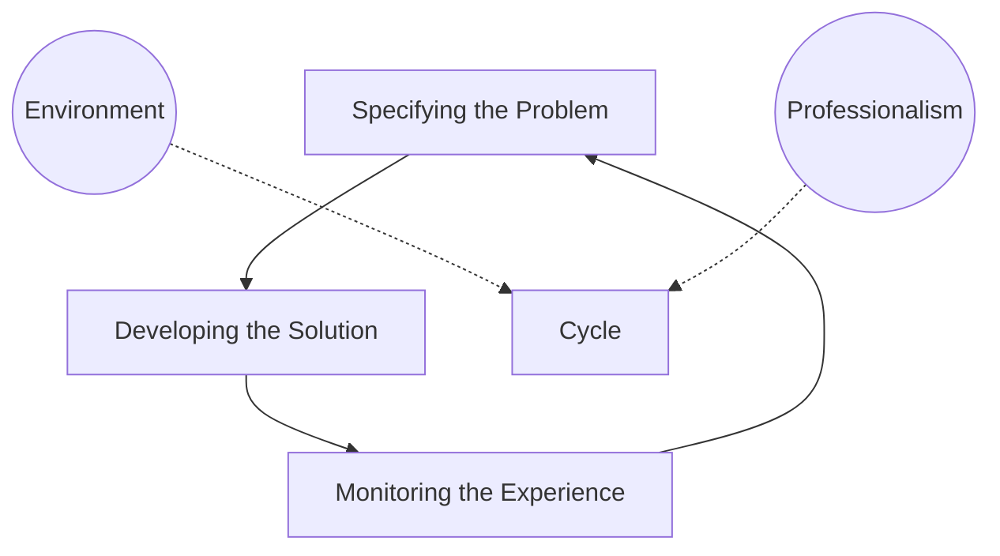
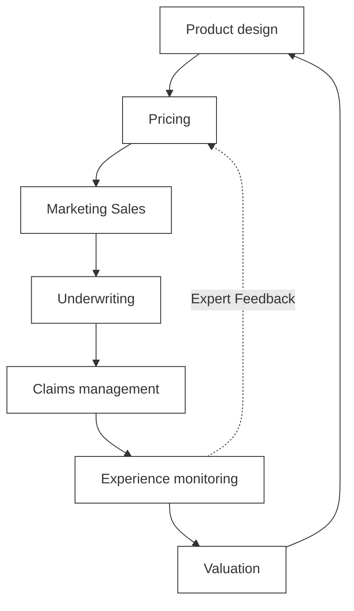

# Ch 1: Introduction

## 0. Introduction
- This introductory chapter provides an overview of health and care insurance, linking concepts from SP1 and establishing the control/product cycles.
- Sections covered: Advice for passing SA1, Links with SP1, Control and product cycles, and Further reading.
## 1. Advice to help you pass Subject SA1
### 1.1 Higher skills
- **Analysis**: Identify issues and investigations required in complex/unusual situations. Pore over details carefully.
- **Synthesis**: Creative activity. Suggest methods/solutions based on analysis. Filter out irrelevant or minor points.
- **Critical judgement**: Make decisions/recommendations based on quality of supporting arguments rather than just the final result.
- **Communication**: Use clear logical structure and meet audience needs (e.g., Marketing vs Director).

### 1.2 Problem solving
- Revisit these skills in Chapter 26 "Solving Complex Issues".

## 2. Links with Subject SP1
- Subject SA1 builds upon SP1, revisiting topics in greater depth.
- Knowledge of the entire SP1 course is essential for the SA1 exam.

## 3. Control and product cycles
### 3.1 The actuarial control cycle

### 3.2 The product cycle (Waterfall View)

## 4. Suggested further reading
- Additional reading mentioned in Core Reading (IFE 2024).
- Further reading recommended by ActEd.
- Candidates should read about current developments in global health and care markets.
